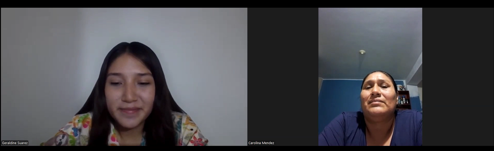
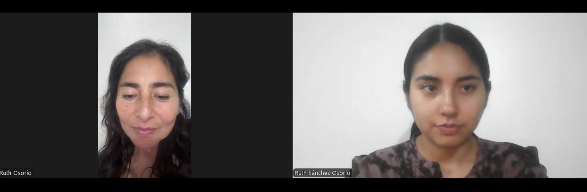
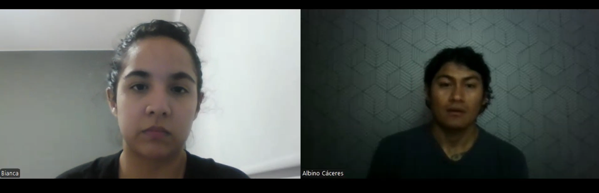
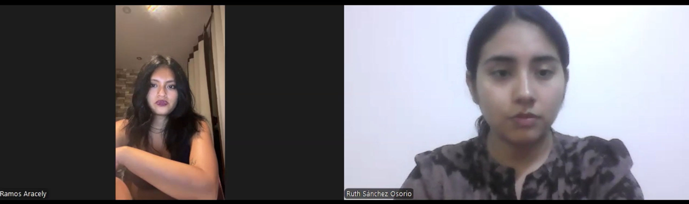
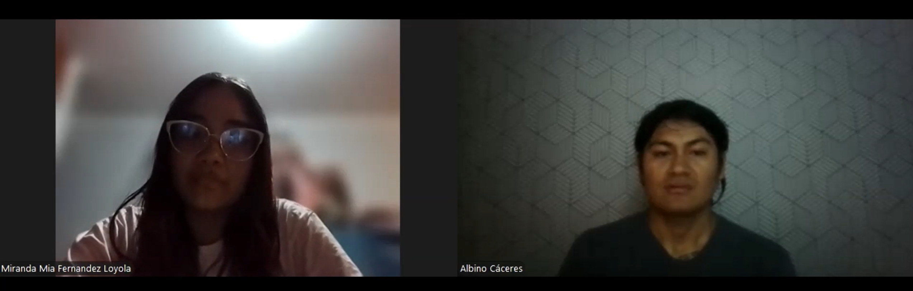
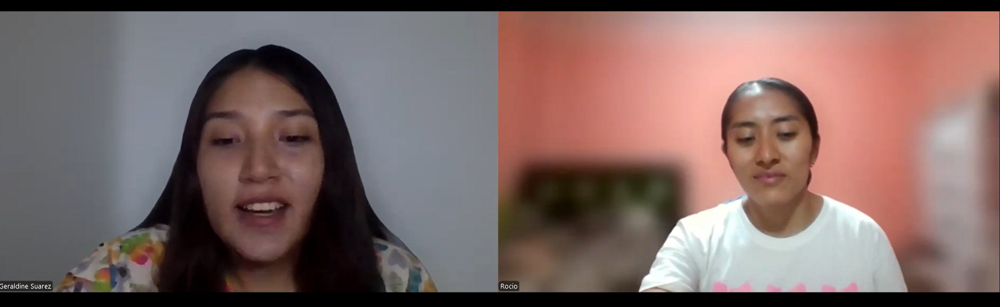

# Capítulo II: Requirements Elicitation & Analysis

## 2.1. Competidores.

Para Ventix, hemos identificado tres tipos de competidores que actualmente dominan o influyen en el mercado del confort ambiental:

- Gigantes del Smart Home (Xiaomi, Philips): Ofrecen ventiladores y purificadores con apps robustas pero cerradas.
- Sistemas de Gama Alta (Dyson): Soluciones premium con sensores de alta precisión, pero a precios inalcanzables para el estudiante promedio.
- Proyectos DIY de Nicho: Repositorios en GitHub de control básico de ventiladores, que son abiertos pero carecen de una interfaz web profesional o una API documentada.

### 2.1.1. Análisis competitivo.

<table border="1" cellspacing="0" cellpadding="5">
  <!-- Título principal -->
  <tr>
    <th colspan="6">Competitive Analysis Landscape</th>
  </tr>

  <!-- Explicación -->
  <tr>
    <th>¿Por qué llevar a cabo este análisis?</th>
    <td colspan="5">
      Este análisis se lleva a cabo con la finalidad de poder conocer las diferentes soluciones ya existentes y cómo Ventix se diferencia y podría mostrarse como una mejor opción ante estas.
    </td>
  </tr>

  <!-- Encabezados competidores con imágenes -->
  <tr>
    <th colspan="2">Competidores</th>
    <th>
      Ventix 
      
    </th>
    <th>
      Xiami 
      
    </th>
    <th>
      Dyson 
      
    </th>

  </tr>

  <!-- PERFIL -->
  <tr>
    <th rowspan="2">Perfil</th>
    <th>Overview</th>
    <td>Sistema IoT de código abierto que automatiza la ventilación basándose en niveles reales de CO2 y temperatura.</td>
    <td>Ventiladores inteligentes integrados a un ecosistema masivo de domótica (Mi Home).</td>
    <td>Dispositivos de lujo con filtración HEPA y diseño sin aspas de alta ingeniería.</td>
  </tr>
  <tr>
    <th>Ventaja competitiva ¿Qué valor ofrece a los clientes?</th>
    <td>Soberanía de datos y Open Source. El usuario es dueño del código y el hardware es de bajo costo y personalizable.</td>
    <td>Ecosistema y conveniencia. Gran integración con otros dispositivos y configuración "Plug & Play".</td>
    <td>Tecnología avanzada y estatus. Purificación de grado médico y diseño industrial icónico.</td>
  </tr>

  <!-- PERFIL DE MARKETING -->
  <tr>
    <th rowspan="2">Perfil de Marketing</th>
    <th>Mercado objetivo</th>
    <td>Estudiantes universitarios y profesionales en modalidad Home Office con interés técnico.</td>
    <td>Usuarios de tecnología que buscan un hogar conectado a precio accesible.</td>
    <td>Clientes de alto poder adquisitivo y personas con problemas respiratorios crónicos.</td>
  </tr>
  <tr>
    <th>Estrategias de marketing</th>
    <td>Marketing de nicho enfocado en la productividad y salud, apoyado en comunidades de software libre.</td>
    <td>Marketing masivo, presencia en retail físico y fidelización por ecosistema.</td>
    <td>Marketing basado en innovación, exclusividad y diseño de alta gama.</td>
  </tr>

  <!-- PERFIL DE PRODUCTO -->
  <tr>
    <th rowspan="3">Perfil de Producto</th>
    <th>Productos & Servicios</th>
    <td>Dashboard Web (Angular), API REST y firmware para hardware DIY.</td>
    <td>Ventiladores físicos con conectividad WiFi y app móvil propietaria.</td>
    <td>Purificadores multifunción con sensores de partículas avanzados.</td>
  </tr>
  <tr>
    <th>Precios & Costos</th>
    <td>Económico. Costo de materiales (BOM) estimado en < $50 USD.</td>
    <td>Moderado. Precios entre $60 y $150 USD dependiendo del modelo.</td>
    <td>Alto. Precios que oscilan entre $400 y $800+ USD.</td>
  </tr>
  <tr>
    <th>Canales de distribución (Web y/o Móvil)</th>
    <td>Web. Repositorio de código y despliegue del frontend en la nube.</td>
    <td>Móvil / Retail. App Mi Home y tiendas físicas/distribuidores.</td>
    <td>Móvil / Retail. App MyDyson y tiendas de lujo/centros comerciales.</td>
  </tr>

  <!-- ANÁLISIS SWOT -->
  <tr>
    <th rowspan="4">Análisis SWOT</th>
    <th>Fortalezas</th>
    <td>Transparencia absoluta, cero dependencia de nubes externas, costo mínimo y enfoque en CO2</td>
    <td>Marca reconocida, estética minimalista y facilidad de uso extremo.</td>
    <td>Mejor tecnología de filtrado del mercado y altísima fidelidad de marca.</td>
  </tr>
  <tr>
    <th>Debilidades</th>
    <td>Requiere que el usuario tenga conocimientos básicos o interés en ensamblar hardware.</td>
    <td>Privacidad cuestionable (datos en servidores externos) y poca flexibilidad de personalización fuera de su app.</td>
    <td>Precio prohibitivo para el estudiante promedio y ecosistema cerrado de repuestos caros.</td>
  </tr>
  <tr>
    <th>Oportunidades</th>
    <td>Crecimiento de la cultura "Maker" y preocupación por la privacidad de datos en el hogar.</td>
    <td>Expansión de su catálogo de sensores para incluir medición de CO2 de forma masiva.</td>
    <td>Implementación de modelos de suscripción para el mantenimiento de filtros.</td>
  </tr>
  <tr>
    <th>Amenazas</th>
    <td>Entrada de marcas chinas a precios agresivos que imiten la automatización por sensores.</td>
    <td>Saturación del mercado de ventiladores inteligentes de bajo costo.</td>
    <td>Soluciones Open Source o alternativas de gama media que demuestren resultados similares en salud.</td>
  </tr>
</table>

### 2.1.2. Estrategias y tácticas frente a competidores.

Luego de haber realizado el análisis de nuestra solución con respecto a soluciones ya existentes, nuestro equipo procederá a plantear estrategias y tácticas que debemos poner en marcha para sobresalir de las otras soluciones.

#### Matriz CAME para el desarrollo de estrategias en base al análisis FODA

| **Análisis FODA cruzado** | **Oportunidades** | **Amenazas** |
|---|---|---|
| **Fortalezas (F)** 1. Enfoque en soberanía de datos y privacidad. 2. Modelo open source con hardware accesible. 3. Especialización en monitoreo de CO₂ y productividad académica/laboral. 4. Costos de implementación bajos frente a sistemas comerciales. | **Estrategia (FO) — Estrategias Ofensivas** 1. Alianzas con comunidades universitarias y makers para validar prototipos y expandir el ecosistema Ventix. 2. Posicionamiento como solución académica y de teletrabajo, destacando impacto en concentración y salud. 3. Roadmap de integraciones IoT: sensores de CO₂, humedad y temperatura con APIs abiertas. 4. Campañas de concientización sobre “fatiga ambiental” dirigidas a estudiantes y profesionales remotos. 5. Estrategia freemium → up-sell: kits básicos para adopción rápida y planes premium para instituciones educativas. | **Estrategia (FA) — Estrategias Defensivas** 1. Documentar y comunicar políticas de seguridad y privacidad adaptadas a entornos académicos y laborales. 2. Ofrecer soporte local y comunidad activa en GitHub para contrarrestar ecosistemas cerrados. 3. Diferenciarse por transparencia y accesibilidad frente a competidores globales (Xiaomi, Dyson). 4. Diseñar funcionalidades offline/parciales para minimizar fricción en zonas con conectividad limitada. 5. Difundir resultados de pilotos y casos de uso en universidades para contrarrestar la ventaja presupuestal de marcas establecidas. |
| **Debilidades (D)** 1. Bajo reconocimiento de marca (startup emergente). 2. Recursos limitados frente a gigantes del Smart Home. 3. Madurez inicial en integraciones empresariales. 4. Necesidad de validación en distintos contextos académicos y laborales. | **Estrategia (DO) — Reorientación** 1. Validación rápida con Lean UX: pruebas de usabilidad y pilotos documentados en aulas y oficinas. 2. Buscar subvenciones y programas de innovación tecnológica para financiar pilotos. 3. Generar contenido técnico y académico: whitepapers, casos de estudio y guías para decisores. 4. Priorizar desarrollo de APIs públicas y SDKs para integradores, reduciendo fricción de adopción. 5. Crear un programa de partners locales (clubes makers, consultoras) para escalar despliegues sin aumentar plantilla interna. | **Estrategia (DA) — Supervivencia** 1. Priorizar seguridad e infraestructura crítica: backups automáticos, alta disponibilidad y pruebas de penetración. 2. Política de precios defensiva inicial: kits entry-level competitivos y promociones para ganar masa crítica. 3. Obtener certificaciones de seguridad y calidad ambiental como sello de confianza. 4. Buscar aceleradoras y socios estratégicos que aporten recursos sin diluir el control del producto. 5. Formalizar un plan de gestión de incidentes y comunicación para reducir impacto reputacional. |

## 2.2. Entrevistas

### 2.2.1. Diseño la entrevistas.

## Segmento Objetivo 1: Estudiantes universitarios en espacios cerrados

<h4 id="PreguntPersonal">Preguntas Personales:</h4>

Me podrías brindar tu nombre, edad y a qué te dedicas actualmente?

<h4 id="PreguntEspe">Preguntas específicas:</h4>

1- ¿Dónde sueles estudiar y cuántas horas pasas ahí al día?

2- ¿En qué momento del día estudias más (mañana, tarde o noche)?

3- ¿Sueles estudiar con la puerta o ventana cerrada? ¿Por qué?

4- ¿Cómo describirías el ambiente de tu habitación (calor, ventilación, aire pesado)?

5- ¿Has sentido cansancio o somnolencia después de estudiar varias horas seguidas?

6- ¿Sientes que tu concentración disminuye con el paso del tiempo en ese ambiente?

7- ¿Alguna vez interrumpes tu estudio para ventilar el cuarto o encender un ventilador?

8- ¿Qué tan frecuente ocurre esa interrupción?

9- ¿Qué haces actualmente para mejorar el ambiente donde estudias?

10- Antes de hoy, ¿sabías que altos niveles de CO₂ pueden afectar tu rendimiento?

11- ¿Qué tan útil sería para ti que el sistema se active automáticamente sin que tengas que intervenir?

## Segmento Objetivo 2: Responsables del hogar (monitoreo remoto)

<h4 id="PreguntPersonal">Preguntas Personales:</h4>

Me podrías brindar tu nombre, edad y a qué te dedicas actualmente?

<h4 id="PreguntEspe">Preguntas específicas:</h4>

1- ¿Cuál es tu ocupación y cuánto tiempo pasas fuera de casa al día?

2- ¿Sueles dejar habitaciones cerradas cuando sales de casa?

3- ¿Al regresar has notado que el ambiente está cargado o caluroso?

4- ¿Te preocupa la calidad del aire dentro de tu hogar cuando no estás presente?

5- ¿Actualmente utilizas algún sistema para monitorear tu hogar?

6- ¿Qué tan importante es para ti poder supervisar tu hogar a distancia?

7- ¿Te gustaría ver datos en tiempo real sobre temperatura o calidad del aire?

8- ¿Te sería útil poder activar un ventilador antes de llegar a casa?

9- ¿Qué tan importante es que el sistema funcione automáticamente sin intervención?

10- ¿Qué valorarías más: control remoto, automatización o ahorro de energía?

11- ¿Estaría dispuesto a probar una solución que mejore automáticamente la ventilación de su hogar ?

### 2.2.2. Registro de entrevistas

#### Segmento 2:
* Entrevista 1:

| Nombre                         | Carolina                                                                                                                                                                                                                                                                                                                                   |      
|--------------------------------|--------------------------------------------------------------------------------------------------------------------------------------------------------------------------------------------------------------------------------------------------------------------------------------------------------------------------------------------|
| Apellido                       | Mendez                                                                                                                                                                                                                                                                                                                                     |      
| Edad                           | 42                                                                                                                                                                                                                                                                                                                                         |      
| Distrito                       | Chimu, SJL                                                                                                                                                                                                                                                                                                                                 |      
| Evidencia                      |                                                                                                                                                                                                                                                                   |      
| URL                            | [Entrevista](https://upcedupe-my.sharepoint.com/:v:/g/personal/u202313458_upc_edu_pe/IQAo8kghVR0jQo02440igfIBATodaC33GN97H5RdWyOYXfc?nav=eyJyZWZlcnJhbEluZm8iOnsicmVmZXJyYWxBcHAiOiJPbmVEcml2ZUZvckJ1c2luZXNzIiwicmVmZXJyYWxBcHBQbGF0Zm9ybSI6IldlYiIsInJlZmVycmFsTW9kZSI6InZpZXciLCJyZWZlcnJhbFZpZXciOiJNeUZpbGVzTGlua0NvcHkifX0&e=rfRIw7) |      
| Inicio de Entrevista           | 00:00                                                                                                                                                                                                                                                                                                                                      |      
| Fin de entrevista              | 05:11                                                                                                                                                                                                                                                                                                                                      |      
| Estado Civil                   | Casada                                                                                                                                                                                                                                                                                                                                     |      
| Ocupacion                      | Consultora independiente de Marketing                                                                                                                                                                                                                                                                                                      |          

Resumen: 

Carolina Méndez, consultora independiente de marketing de 42 años, pasa la mayor parte del día fuera de casa (9 a 10 horas) y a veces viaja por trabajo, dejando el hogar solo o con su esposo, hijos y padres, pero ambiente algo sellado. Siempre mantiene las habitaciones cerradas por seguridad, lo que ocasiona ambientes sofocantes y pesado de calor u humedad, especialmente en verano. Le preocupa la calidad del aire al regresar y considera fundamental poder supervisar su hogar a distancia, aunque, no utiliza sistemas de monitoreo actualmente, valora la posibilidad de contar con datos en tiempo real, activar ventiladores antes de llegar y que el sistema funcione automáticamente. Prefiere soluciones de bajo costo, como de código abierto, siempre que sean confiables, fáciles de instalar, y estaría dispuesta a implementarlas para mejorar el ambiente de su hogar.

* Entrevista 2:

| Nombre                         | Ruth                                                                                                                                                                                                                                                                                                                                       |      
|--------------------------------|--------------------------------------------------------------------------------------------------------------------------------------------------------------------------------------------------------------------------------------------------------------------------------------------------------------------------------------------|
| Apellido                       | Ozorio                                                                                                                                                                                                                                                                                                                                     |      
| Edad                           | 43                                                                                                                                                                                                                                                                                                                                         |      
| Distrito                       | San Miguel                                                                                                                                                                                                                                                                                                                                 |      
| Evidencia                      |                                                                                                                                                                                                                                                                   |      
| URL                            | [Entrevista](https://upcedupe-my.sharepoint.com/:v:/g/personal/u202313458_upc_edu_pe/IQAo8kghVR0jQo02440igfIBATodaC33GN97H5RdWyOYXfc?nav=eyJyZWZlcnJhbEluZm8iOnsicmVmZXJyYWxBcHAiOiJPbmVEcml2ZUZvckJ1c2luZXNzIiwicmVmZXJyYWxBcHBQbGF0Zm9ybSI6IldlYiIsInJlZmVycmFsTW9kZSI6InZpZXciLCJyZWZlcnJhbFZpZXciOiJNeUZpbGVzTGlua0NvcHkifX0&e=rfRIw7) |      
| Inicio de Entrevista           | 05:16                                                                                                                                                                                                                                                                                                                                      |      
| Fin de entrevista              | 10:54                                                                                                                                                                                                                                                                                                                                      |      
| Estado Civil                   |                                                                                                                                                                                                                                                                                                                                            |      
| Ocupacion                      | Contadora Publica                                                                                                                                                                                                                                                                                                                          |      

Resumen: Ruth explica que pasa entre 8 y 10 horas fuera de casa y suele dejar todas las habitaciones cerradas por seguridad y limpieza. Al regresar, percibe frecuentemente un ambiente cargado y caluroso, lo que le genera preocupación por la salud de su familia y la posible proliferación de insectos.  A pesar de no contar actualmente con un sistema de monitoreo, la entrevistada muestra un alto interés en soluciones tecnológicas. Valora especialmente la capacidad de supervisión remota y la automatización, prefiriendo que el sistema actúe de forma autónoma basándose en la calidad del aire. Finalmente, Ruth se muestra dispuesta a instalar una solución de bajo costo y código abierto, siempre que sea fácil de mantener y mejore su bienestar doméstico.

* Entrevista 3:

| Nombre                         | Bianca                                                                                                                                                                                                                                                                                                                                     |      
|--------------------------------|--------------------------------------------------------------------------------------------------------------------------------------------------------------------------------------------------------------------------------------------------------------------------------------------------------------------------------------------|
| Apellido                       | Morales                                                                                                                                                                                                                                                                                                                                    |      
| Edad                           | 25                                                                                                                                                                                                                                                                                                                                         |      
| Distrito                       | Miraflores                                                                                                                                                                                                                                                                                                                                 |      
| Evidencia                      |                                                                                                                                                                                                                                                                   |      
| URL                            | [Entrevista](https://upcedupe-my.sharepoint.com/:v:/g/personal/u202313458_upc_edu_pe/IQAo8kghVR0jQo02440igfIBATodaC33GN97H5RdWyOYXfc?nav=eyJyZWZlcnJhbEluZm8iOnsicmVmZXJyYWxBcHAiOiJPbmVEcml2ZUZvckJ1c2luZXNzIiwicmVmZXJyYWxBcHBQbGF0Zm9ybSI6IldlYiIsInJlZmVycmFsTW9kZSI6InZpZXciLCJyZWZlcnJhbFZpZXciOiJNeUZpbGVzTGlua0NvcHkifX0&e=rfRIw7) |      
| Inicio de Entrevista           | 11:03                                                                                                                                                                                                                                                                                                                                      |      
| Fin de entrevista              | 17:03                                                                                                                                                                                                                                                                                                                                      |      
| Estado Civil                   | Soltera                                                                                                                                                                                                                                                                                                                                    |      
| Ocupacion                      | Asistente administrativo                                                                                                                                                                                                                                                                                                                   |         

Resumen:

Bianca, de 25 años, trabaja como asistente administrativa y pasa la mayor parte del día fuera de casa. Debido a esto, su vivienda permanece cerrada durante largas horas, lo que provoca que el ambiente se vuelva caluroso y con aire cargado, especialmente en épocas de verano.Aunque cuenta con sistemas de seguridad como cámaras, no dispone de herramientas para monitorear la calidad del aire. Esta situación le genera preocupación, ya que deja a su hermano menor y a su mascota en casa, lo que aumenta su interés por conocer el estado del ambiente mientras no está. Bianca valora altamente la automatización, ya que no tiene tiempo para gestionar manualmente estos aspectos. Además, muestra interés en soluciones simples que le permitan visualizar el estado del ambiente y mejorar la ventilación de forma automática. Está dispuesta a probar una solución de este tipo, siempre que sea fácil de instalar y accesible económicamente.

#### Segmento 1:

* Entrevista 1:

| Nombre                         | Aracely                                                                                                                                                                                                                                                                                                                                    |      
|--------------------------------|--------------------------------------------------------------------------------------------------------------------------------------------------------------------------------------------------------------------------------------------------------------------------------------------------------------------------------------------|
| Apellido                       | Ramos                                                                                                                                                                                                                                                                                                                                      |      
| Edad                           | 20                                                                                                                                                                                                                                                                                                                                         |      
| Distrito                       | Surco                                                                                                                                                                                                                                                                                                                                      |      
| Evidencia                      |                                                                                                                                                                                                                                                                   |      
| URL                            | [Entrevista](https://upcedupe-my.sharepoint.com/:v:/g/personal/u202313458_upc_edu_pe/IQAo8kghVR0jQo02440igfIBATodaC33GN97H5RdWyOYXfc?nav=eyJyZWZlcnJhbEluZm8iOnsicmVmZXJyYWxBcHAiOiJPbmVEcml2ZUZvckJ1c2luZXNzIiwicmVmZXJyYWxBcHBQbGF0Zm9ybSI6IldlYiIsInJlZmVycmFsTW9kZSI6InZpZXciLCJyZWZlcnJhbFZpZXciOiJNeUZpbGVzTGlua0NvcHkifX0&e=rfRIw7) |      
| Inicio de Entrevista           | 17:05                                                                                                                                                                                                                                                                                                                                      |      
| Fin de entrevista              | 23:01                                                                                                                                                                                                                                                                                                                                      |      
| Estado Civil                   | Soltera                                                                                                                                                                                                                                                                                                                                    |      
| Ocupacion                      | Estudiante                                                                                                                                                                                                                                                                                                                                 |         

Resumen:

Aracely estudia principalmente en su habitación entre 5 y 6 horas diarias, incrementándose según la carga académica. Prefiere estudiar de noche por el silencio, aunque admite que es cuando más se agota. Debido al ruido externo, el frío o el polvo, suele mantener puertas y ventanas cerradas, lo que provoca que el aire se sienta "pesado" y caluroso tras un par de horas.
 La entrevistada describe síntomas claros de una mala calidad del aire: cansancio, somnolencia, bostezos y pérdida de concentración. Desconocía que los niveles de CO2 afectaban su rendimiento, atribuyendo el agotamiento solo al exceso de estudio. Actualmente, interrumpe sus sesiones cada una o dos horas para ventilar manualmente, lo cual rompe su ritmo. Aracely concluye mostrando gran interés en un dispositivo automatizado y económico que gestione el ambiente sin su intervención, confiando en que mejoraría significativamente su productividad.

* Entrevista 2:

| Nombre                         | Miranda                                                                                                                                                                                                                                                                                                                                    |      
|--------------------------------|--------------------------------------------------------------------------------------------------------------------------------------------------------------------------------------------------------------------------------------------------------------------------------------------------------------------------------------------|
| Apellido                       | Fernandez                                                                                                                                                                                                                                                                                                                                  |      
| Edad                           | 21                                                                                                                                                                                                                                                                                                                                         |      
| Distrito                       | Jesus Maria                                                                                                                                                                                                                                                                                                                                |      
| Evidencia                      |                                                                                                                                                                                                                                                                   |      
| URL                            | [Entrevista](https://upcedupe-my.sharepoint.com/:v:/g/personal/u202313458_upc_edu_pe/IQAo8kghVR0jQo02440igfIBATodaC33GN97H5RdWyOYXfc?nav=eyJyZWZlcnJhbEluZm8iOnsicmVmZXJyYWxBcHAiOiJPbmVEcml2ZUZvckJ1c2luZXNzIiwicmVmZXJyYWxBcHBQbGF0Zm9ybSI6IldlYiIsInJlZmVycmFsTW9kZSI6InZpZXciLCJyZWZlcnJhbFZpZXciOiJNeUZpbGVzTGlua0NvcHkifX0&e=rfRIw7) |      
| Inicio de Entrevista           | 23:02                                                                                                                                                                                                                                                                                                                                      |      
| Fin de entrevista              | 26:13                                                                                                                                                                                                                                                                                                                                      |      
| Estado Civil                   | Soltera                                                                                                                                                                                                                                                                                                                                    |      
| Ocupacion                      | Estudiante                                                                                                                                                                                                                                                                                                                                 |        

Resumen:

Miranda, estudiante de Periodismo de 21 años, realiza sus actividades académicas principalmente en su habitación durante varias horas al día, especialmente en la noche debido al ruido en su hogar. Para poder concentrarse, suele estudiar con la puerta y ventana cerradas, lo que reduce la ventilación del espacio. Con el paso del tiempo, el ambiente se vuelve más caluroso y el aire se siente pesado, lo que le genera somnolencia, cansancio y una disminución en su concentración. Aunque en ocasiones interrumpe su estudio para ventilar o encender un ventilador, no siempre lo hace a tiempo. Miranda no tenía conocimiento sobre el impacto del CO₂ en el rendimiento, pero reconoce que el ambiente influye en su desempeño. Además, muestra interés en una solución automatizada que mejore la ventilación, siempre que sea fácil de instalar y accesible.

* Entrevista 3:

| Nombre                         | Rocio                                                                                                                                                                                                                                                                                                                                      |      
|--------------------------------|--------------------------------------------------------------------------------------------------------------------------------------------------------------------------------------------------------------------------------------------------------------------------------------------------------------------------------------------|
| Apellido                       | Sanchez                                                                                                                                                                                                                                                                                                                                    |      
| Edad                           | 22                                                                                                                                                                                                                                                                                                                                         |      
| Distrito                       |                                                                                                                                                                                                                                                                                                                                            |      
| Evidencia                      |                                                                                                                                                                                                                                                                   |      
| URL                            | [Entrevista](https://upcedupe-my.sharepoint.com/:v:/g/personal/u202313458_upc_edu_pe/IQAo8kghVR0jQo02440igfIBATodaC33GN97H5RdWyOYXfc?nav=eyJyZWZlcnJhbEluZm8iOnsicmVmZXJyYWxBcHAiOiJPbmVEcml2ZUZvckJ1c2luZXNzIiwicmVmZXJyYWxBcHBQbGF0Zm9ybSI6IldlYiIsInJlZmVycmFsTW9kZSI6InZpZXciLCJyZWZlcnJhbFZpZXciOiJNeUZpbGVzTGlua0NvcHkifX0&e=rfRIw7) |      
| Inicio de Entrevista           | 26:15                                                                                                                                                                                                                                                                                                                                      |      
| Fin de entrevista              | 32:31                                                                                                                                                                                                                                                                                                                                      |      
| Estado Civil                   | Soltera                                                                                                                                                                                                                                                                                                                                    |      
| Ocupacion                      | Estudiante                                                                                                                                                                                                                                                                                                                                 |         

Resumen:

Rocío estudia en su habitación entre 5 y 7 horas diarias, tiempo que aumenta significativamente durante periodos de exámenes. Debido al ruido exterior y al deseo de privacidad, suele mantener la puerta y ventana cerradas. Esto provoca que, tras un par de horas, el aire se sienta "pesado" y el ambiente se vuelva caluroso y sofocante.

La entrevistada asocia esta falta de ventilación con síntomas como agotamiento, sueño y falta de concentración, admitiendo que desconocía el impacto directo de los niveles de CO2 en su capacidad de estudio. Rocío actualmente ventila de forma manual abriendo ventanas o encendiendo un ventilador, lo que interrumpe su ritmo. Finalmente, expresa un fuerte interés en un sistema automatizado, configurable y de bajo costo que regule el ambiente de forma autónoma para mejorar su bienestar y productividad.

### 2.2.3. Análisis de entrevistas 

En esta sección se presenta el análisis detallado de la información recolectada. Para cada segmento, se explican primero los hallazgos estadísticos objetivos y subjetivos, seguidos de la evidencia gráfica correspondiente.

### Segmento 1: Estudiantes Universitarios en Espacios Cerrados  

**Análisis de Características Objetivas y Subjetivas**  

El análisis revela condiciones deficientes en espacios de estudio. Como se detalla en el gráfico a continuación:

Los principales factores que afectan la experiencia de los estudiantes se concentran en la falta de ventilación (25%), la somnolencia tras largas horas de estudio continuo (20%), la disminución de la concentración debido al aire pesado o caluroso (18%), las interrupciones generadas por la necesidad de ajustar ventiladores fisicos (15%) y la percepción de falta de soluciones simples y accesibles (22%).

### Segmento 2: Tutores o dueños de casa que necesiten monitoriar en el exterior 

**Análisis de Características Objetivas y Subjetivas** 

Los datos confirman una experiencia limitada en la gestión del ambiente doméstico, especialmente cuando el usuario no se encuentra dentro del hogar de manera constante. Como se detalla en el gráfico a continuación:

Los principales factores que afectan la tranquilidad y el control del entorno del hogar se concentran en la limitada ventilación en espacios cerrados (24%), la preocupación por el bienestar de mascotas, niños o personas mayores en ausencia del usuario (22%), la dificultad para supervisar las condiciones ambientales en tiempo real (19%), las interrupciones generadas por la necesidad de realizar ajustes manuales al regresar al hogar (17%) y la desconfianza hacia soluciones tecnológicas que no garantizan privacidad ni control de datos (18%).

### Análisis Comparativo  

**Contrastación de Segmentos**  

Al comparar ambos grupos, se identifican coincidencias clave para el desarrollo del producto:

Tanto estudiantes como dueños de casa evidencian que los principales factores que afectan su experiencia están relacionados con condiciones ambientales deficientes, especialmente la falta de ventilación y la necesidad de intervención constante para regular el entorno. En ambos segmentos, estos factores representan una proporción relevante dentro del análisis (entre 15% y 25%), lo que refuerza la necesidad de automatizar y centralizar la gestión del ambiente para mejorar la experiencia del usuario. Sin embargo, existe una diferencia clave en la prioridad de sus necesidades. Los estudiantes otorgan mayor importancia a la accesibilidad de soluciones (22%), priorizando herramientas simples, económicas y fáciles de usar que no interrumpan su concentración. Por otro lado, los dueños de casa ponen mayor énfasis en la posibilidad de monitoreo remoto, la seguridad del entorno y la privacidad de la información (22%), considerando fundamental mantener el control del hogar incluso en su ausencia.

Esto define la propuesta de valor del sistema: accesibilidad y simplicidad para estudiantes, y control remoto, seguridad y confianza para dueños de casa.

### Conclusiones y Definición de tipos

**Estudiante ("El Aprendiz Concentrado")**

Rasgo clave: Busca mejorar su rendimiento académico en espacios cerrados.
Sustento: Los factores más influyentes en su experiencia son la falta de ventilación (25%), la somnolencia (20%) y la percepción de falta de soluciones accesibles (22%). Esto evidencia que necesita un entorno cómodo y herramientas simples que no interrumpan su flujo de estudio. La solución debe tener una curva de aprendizaje mínima y un costo accesible.

**Dueño de Casa ("El Supervisor del Hogar")**

Rasgo clave: Necesita monitorear y controlar el ambiente de su hogar de forma remota y segura.
Sustento: Los principales factores que afectan su tranquilidad incluyen la ventilación limitada (24%), la preocupación por el bienestar de los ocupantes del hogar (22%) y la dificultad para supervisar el entorno en tiempo real (19%). Esto indica que prioriza soluciones que le permitan mantener control, seguridad y confianza, especialmente cuando no se encuentra en casa. La solución debe centrarse en monitoreo remoto, automatización y protección de datos.

## 2.3. Needfinding
A partir del análisis de entrevistas y la recolección de información sobre las dinámicas en espacios cerrados de estudio y hogar, se identificaron los principales perfiles de usuarios que interactúan directamente con la solución Ventix. Estos perfiles representan los segmentos clave para el sistema, ya que concentran tanto la necesidad de mejorar la concentración y el confort ambiental como la necesidad de contar con herramientas confiables y seguras para la gestión del aire interior.

## 2.3.1. User Personas  

La construcción de los User Persona permite al equipo de desarrollo comprender mejor sus motivaciones, frustraciones y hábitos, lo que resulta esencial para diseñar funcionalidades adecuadas y experiencias de usuario efectivas.

**Segmento 1: Estudiantes Universitarios en Espacios Cerrados**

Para los estudiantes se elaboró el User Persona Maria Elena Lopez. Se consideraron factores como su edad, rutina académica, tiempo prolongado en habitaciones cerradas y la necesidad de mantener concentración durante largas jornadas de estudio. Sus principales frustraciones giran en torno a la somnolencia y la fatiga ambiental, además de la molestia de tener que interrumpir sus actividades para ajustar manualmente la ventilación. Asimismo, se tomó en cuenta su disposición hacia soluciones simples, económicas y open source, que les permitan confiar en la tecnología sin barreras de complejidad.

**Segmento 2: Dueños de Casa que Monitorean su Hogar**

Para este segmento se elaboró el User Persona Luis Estefano Ruiz. Se consideraron aspectos como su edad, estilo de vida y su responsabilidad en el cuidado del hogar. Sus principales motivaciones están orientadas a garantizar el bienestar de las personas y mascotas dentro de su vivienda, así como a mantener condiciones ambientales adecuadas incluso en su ausencia. Sus frustraciones se relacionan con la imposibilidad de supervisar el entorno en tiempo real, la necesidad de realizar ajustes manuales al regresar a casa y la desconfianza hacia dispositivos inteligentes que comprometen la privacidad. Su perfil refleja una predisposición positiva hacia soluciones tecnológicas open source, siempre que estas sean seguras, confiables y le permitan tener control remoto del hogar de manera sencilla.

### 2.3.2. User Task Matrix

El User Task Matrix presenta las tareas que realizan los User Persona para cumplir sus objetivos en su día a día. Se evalúa la frecuencia y la importancia de cada tarea para identificar dónde el sistema Ventix puede automatizar o mitigar riesgos.

| **Tarea(Task)**                                      | **Estudiante (Maria Elena)** | **Dueño de Casa Hogar (Luis)** |
|------------------------------------------------------|------------------------------|--------------------------------|
|                                                      | Frecuencia                   |                                |
| Monitorear la ventilación de espacios cerrados       | Often                        | High                           |
| Verificar la temperatura de las habitaciones         | Occasionally                 | Medium                         |
| Identificar síntomas de somnolencia o fatiga         | Often                        | High                           |
| Abrir ventanas/puertas para renovar el aire          | Often                        | Medium                         |
| Supervisar el bienestar físico de los residentes     | Rarely                       | Low                            |
| Atender alertas por condiciones ambientales críticas | Rarely                       | High                           |
| Revisar el consumo energético de ventiladores/AC     | Monthly                      | Medium                         |
| Analizar reportes de calidad ambiental histórica     | Rarely                       | Low                            |

**Análisis del Task Matrix**

**Actividades Críticas:** El monitoreo de ventilación es la tarea "Core" para ambos (Importancia High / Frecuencia Often). En María Elena impacta el rendimiento académico y en Luis Estéfano la salud pública de los residentes.

**Punto de Dolor Común:** La tarea de "Abrir ventanas" es muy frecuente, validando el valor de la automatización del ventilador de Ventix para reducir la carga operativa manual.

**Gestión de Riesgos:** Aunque las "Alertas críticas" ocurren ocasionalmente, su importancia High justifica la necesidad del sistema de notificaciones en tiempo real para prevenir incidentes de salud.

## 2.3.3. User Journey Mapping
### Segmento 1 – Estudiante Universitaria (María Elena López)  

El User Journey Mapping de María Elena describe su experiencia como estudiante en espacios cerrados a lo largo de sus sesiones de estudio. En el estado actual, identifica que la ventilación limitada y los ajustes manuales del entorno afectan su concentración, generando interrupciones y fatiga. A lo largo del proceso, pasa por etapas de reconocimiento del problema, exploración y evaluación de alternativas, hasta la prueba y adopción de una solución. Este recorrido evidencia la necesidad de un sistema que mantenga condiciones adecuadas de forma automática, incorporando a su vez la posibilidad de intervención manual para mejorar la continuidad y eficiencia en su experiencia de estudio.

### Segmento 2 – Dueño o tutor de casa hogar (Luis Estéfano Ruiz)  

El User Journey Mapping de Luis Estéfano Ruiz describe su experiencia como responsable del hogar que permanece fuera durante gran parte del día. En el estado actual, enfrenta incertidumbre al no tener visibilidad sobre las condiciones ambientales, lo que afecta su tranquilidad. A lo largo del recorrido, identifica el problema, busca alternativas y evalúa opciones hasta probar una solución que le permita monitorear su vivienda. Este proceso evidencia la necesidad de un sistema que mantenga el ambiente de forma automática durante su ausencia y que, al mismo tiempo, le brinde acceso a la información para revisar lo ocurrido y ajustar el entorno según sus preferencias.

## 2.3.4. Empathy Mapping  

Para la elaboración de los Empathy Maps, el equipo partió del conocimiento y observaciones recolectadas durante el análisis de los User Persona. Se colocó al centro de cada mapa al usuario correspondiente (María Elena López y Luis Estéfano Ruiz) y se respondieron las preguntas claves sobre su entorno, emociones, comportamientos y necesidades.

### Segmento 1: Estudiantes Universitarios  

En este mapa se analizó a María Elena López, una estudiante universitaria que busca mantener la concentración en espacios cerrados. Se identificó que percibe que la falta de ventilación afecta su rendimiento y genera fatiga durante el estudio. Además, observa y experimenta interrupciones constantes al tener que ajustar manualmente el ambiente, como abrir ventanas o usar ventiladores. Su principal dolor es la pérdida de enfoque, mientras que su ganancia esperada es contar con un sistema que mantenga el ambiente adecuado automáticamente, pero que también le permita realizar ajustes de forma sencilla cuando lo necesite.

### Segmento 2: Dueños de casa

En este mapa se analizó a Luis Estéfano Ruiz, un usuario que busca mantener la tranquilidad y el control de su hogar mientras se encuentra fuera. Se identificó que percibe incertidumbre al no poder supervisar el ambiente en tiempo real, especialmente por el bienestar de quienes permanecen en casa. Al regresar, revisa el estado del hogar y analiza la información del día para realizar ajustes según sus necesidades. Su principal dolor es la falta de visibilidad durante su ausencia, mientras que su ganancia esperada es contar con un sistema que funcione de manera independiente, pero que también le permita revisar y personalizar el entorno de forma sencilla.

## 2.4. Big Picture Event Storming

**Step 1 – Free Exploration**

En esta primera etapa, el equipo realizó una sesión de lluvia de ideas para capturar todos los eventos relevantes dentro del dominio de monitoreo ambiental, sin preocuparse por el orden o la jerarquía. El objetivo principal fue representar los acontecimientos reales del negocio y del entorno del usuario, de manera independiente a cualquier función técnica

**Step 2 – Structured Organization**

Después de listar los eventos, el equipo los organizó en flujos de negocio lógicos que reflejan las principales etapas en la operación . Esta estructura ayudó a identificar los procesos clave y las áreas de mejora que posteriormente podrían abordarse mediante soluciones digitales o de gestión

## 2.5. Ubiquitous Language

The Ventix Ubiquitous Language defines the technical and business terms that must be used consistently across the source code, user interface, and technical documentation. This eliminates ambiguities between the development team and stakeholders.

| **Term**              | **Definition**                                                                                           | 
|-----------------------|----------------------------------------------------------------------------------------------------------|
| Node                  | A physical or simulated device containing sensors and actuators within a physical space.                 | 
| Threshold             | A configured limit value (ppm, °C, %) that triggers an automatic system action .                         | 
| PPM (CO2 Level)       | Parts Per Million; the standard unit used to measure air quality and ventilation levels .                | 
| Actuator              | The physical component (fan) that performs a mechanical action based on a system command.                | 
| Optimized Mode        | A system state where thresholds adjust automatically to maximize the student's concentration.            |
| Data Sovereignty      | The user's ability to choose local storage for their metrics without cloud dependency.                   | 
| Critical Notification | A high-priority alert state triggered by critical gas levels or extreme temperatures.                    |
| Event Log             | A historical record of all measurements and automatic actions performed by the node.                     |
| Manual Override       | A user action that temporarily bypasses automatic logic to control the fan at will.                      |
| Confort state         | The ideal range of temperature and $CO_2$ defined by the user based on their activity (Study vs. Rest).  |

**Expected Benefits of the Ubiquitous Language:**

- **Facilitates communication among developers, users, and system administrators:** By using terms like "Threshold" or "Optimized Mode", the household manager and the Java developer speak the same language, avoiding confusion over what defines "clean air."

- **Improves understanding of the system’s main functionalities:** Terms like "Manual Override" or "Critical Notification" are self-descriptive, allowing a new student to understand the application’s purpose without an extensive manual.

- **Ensures consistency in documentation, interfaces, and project processes:** It guarantees that a button label on the dashboard matches the endpoint name in the API and the data presented in monthly health reports.
