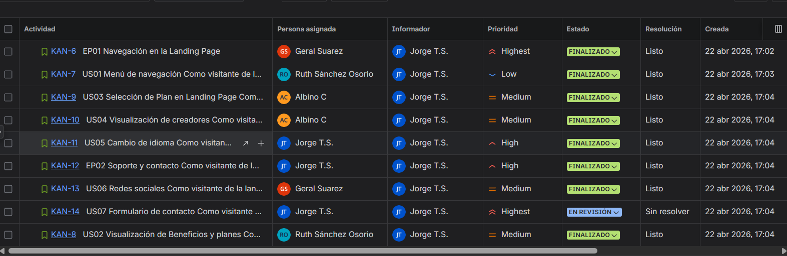
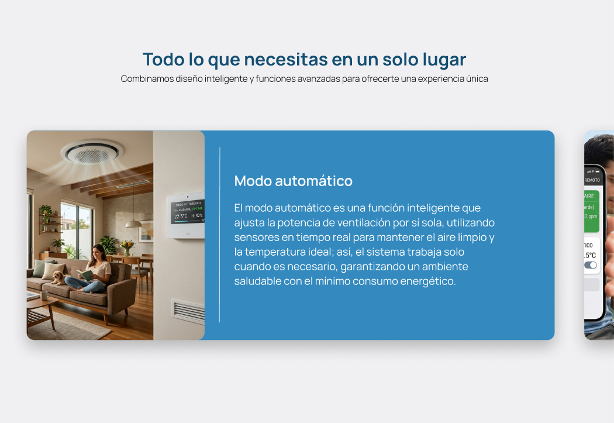
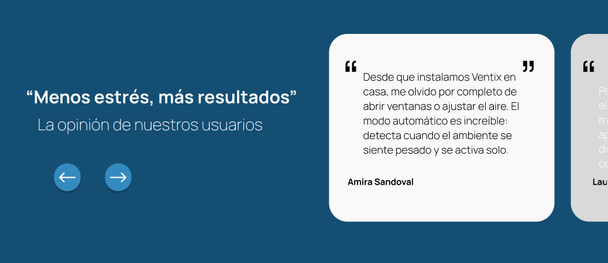
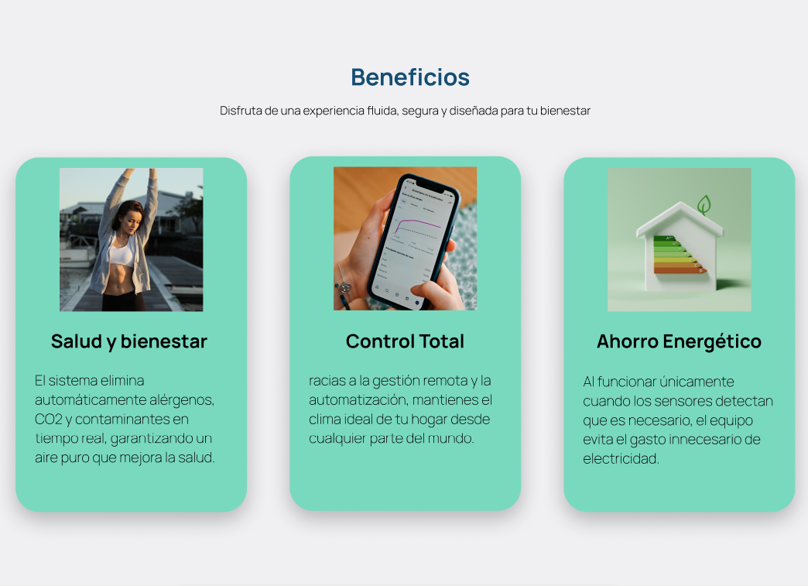
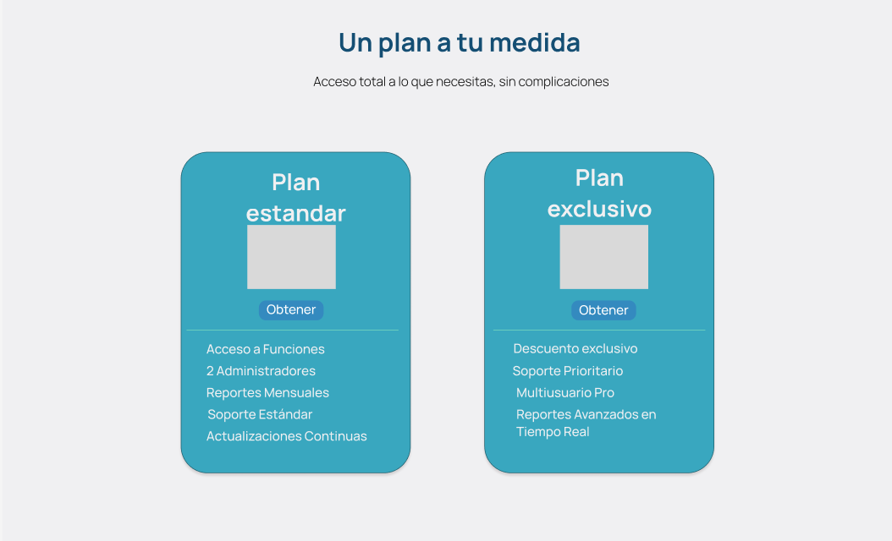
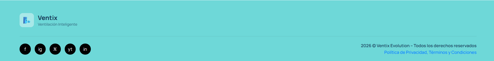
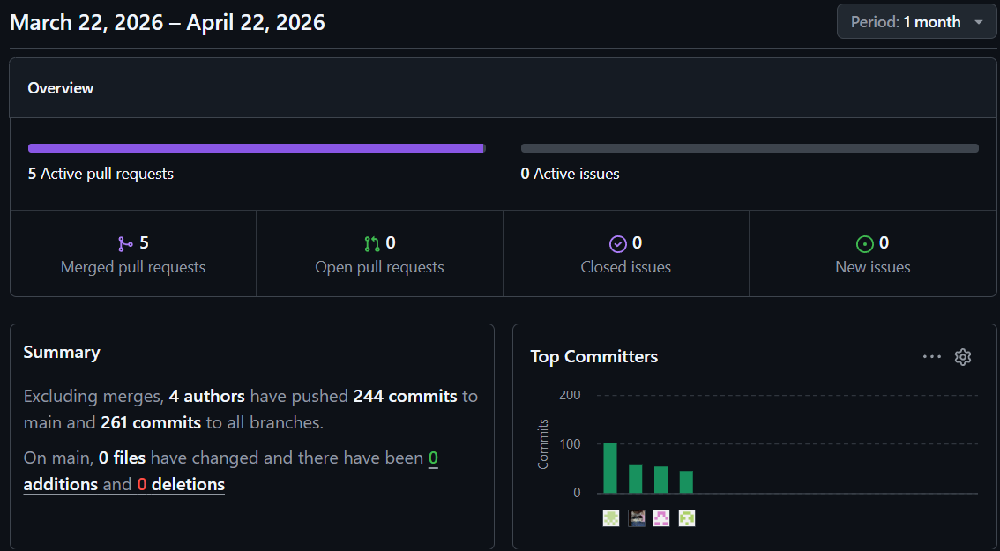
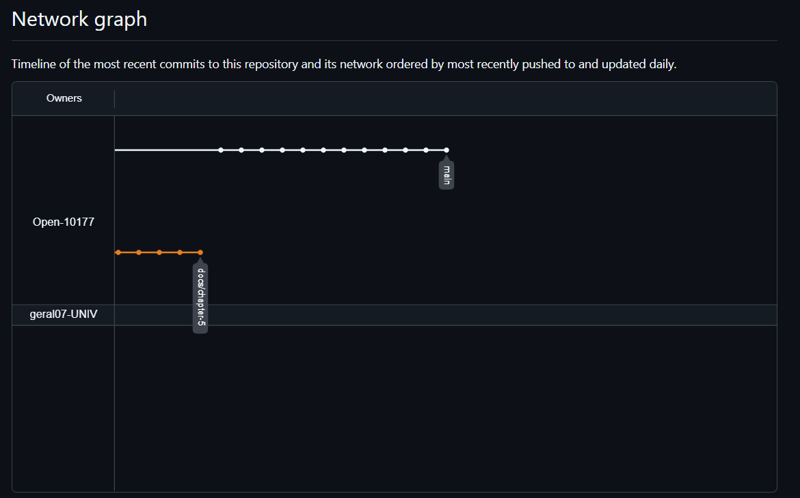
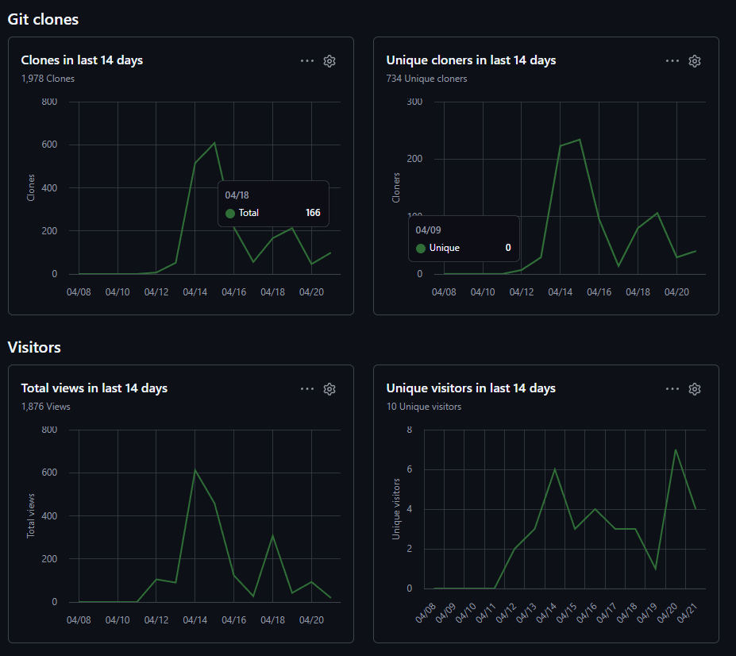

# Capítulo V: Product Implementation, Validation & Deployment

## 5.1. Software Configuration Management.

En esta sección se describen las decisiones, convenciones y principios adoptados por el equipo para garantizar la coherencia, trazabilidad y control de versiones durante el ciclo de vida del desarrollo de la solución Ventix. Se establecen los lineamientos para la configuración del entorno de desarrollo, gestión del código fuente, convenciones de estilo y configuración de despliegue.

### 5.1.1. Software Development Environment Configuration.

En esta sección se especifican los productos de software utilizados durante el ciclo de vida del proyecto, incluyendo el nombre de cada herramienta, su propósito técnico específico dentro del proyecto Ventix, y la ruta de referencia (para software SaaS) o ruta de descarga (para productos de instalación local). Las herramientas se organizan según las siguientes disciplinas:

1. Project Management
2. Requirements Management
3. Product UX/UI Design
4. Software Development
5. Software Testing
6. Software Documentation

**Project Management**

Esta disciplina se centra en la planificación, seguimiento y control de las actividades del proyecto, asegurando el cumplimiento de los objetivos dentro del tiempo y recurso establecidos

* Trello: Plataforma de gestión visual basada en tableros, listas y tarjetas, utilizada para la organización del Sprint Backlog, gestión de User Stories por estado (To-Do, In-Progress, Done) y colaboración del equipo en la priorización de requisitos del proyecto Ventix.
  Ruta de referencia : https://trello.com

  

**Requirements Management**

Este proceso se enfoca en la documentación, verificación y seguimiento de los requisitos del proyecto, asegurando que las necesidades de los stakeholders sean satisfechas.

* Trello: Plataforma de gestión visual basada en tableros, listas y tarjetas, utilizada para la organización del Sprint Backlog, gestión de User Stories por estado (To-Do, In-Progress, Done) y colaboración del equipo en la priorización de requisitos del proyecto Ventix.
  Ruta de referencia : https://trello.com

**Product UX/UI Design**

El diseño de la experiencia de usuario y la interfaz de usuario para Ventix contempla un modelo de sitio web responsivo, compatible con navegadores de escritorio y dispositivos móviles. Se utilizan las siguientes herramientas.

1. **UXPressia:** Plataforma para la elaboración de User Personas, Empathy Maps, Customer Journey Maps e Impact Maps de los segmentos objetivo del proyecto Ventix .
Ruta de referencia: https://uxpressia.com/

  

3. **Miro:** Pizarra digital colaborativa utilizada para sesiones de Big Picture EventStorming y Design-Level EventStorming, facilitando la identificación de Bounded Contexts, Events, Commands y Aggregates del dominio Ventix.
Ruta de referencia: https://miro.com/es/

  
  
4. **Figma:** Herramienta de diseño colaborativo para la creación de Wireframes, Mock-ups y Prototipos interactivos del Landing Page y Web Applications de Ventix, aplicando el Design System basado en Material Design.
Ruta de referencia: https://www.figma.com/es-es/

  

6. **LucidChart:** Aplicación de diagramación colaborativa para la creación de Wireflows, User Flows, diagramas UML (Class Diagrams) y Database Diagrams de la arquitectura de Ventix.
Ruta de referencia: https://www.lucidchart.com/pages/es

  

**Software Development:**

El desarrollo de software del proyecto Ventix abarca la implementación del Langin Page, Frontend Web Application y Backend Web Services. Se utilizan las siguientes herramientas y tecnologías.

1. **GitHub:** Sistema de control de versiones distribuido y plataforma de hosting para repositorios de código fuente. Gestión de la organización Open-10177, implementación de GitFlow Workflow, Conventional Commits y Semantic Versioning.
Ruta de referencia: https://github.com
    
    Organización del proyecto: https://github.com/Open-10177
   
   

3. **WebStorm:** Entorno de desarrollo integrado (IDE) de JetBrains para la implementación del Frontend utilizando Angular Framework, HTML5, CSS3, JavaScript y TypeScript. Incluye integración con GitHub para control de versiones.
Ruta de descarga: https://www.jetbrains.com/webstorm/

    Licencia de estudiante: https://www.jetbrains.com/community/education/
   
    

5. **HTML5, CSS3, JavaScript:** Tecnologías fundamentales para la implementación del Landing Page y estructura base de las Web Applications.
   
    **Referencias:**
   * HTML5: https://html.spec.whatwg.org/
   * CSS3: https://www.w3.org/Style/CSS/
   * JavaScript: https://developer.mozilla.org/es/docs/Web/JavaScript
   
   

**Software Testing**

Las pruebas de software permiten evaluar y verificar que los productos desarrollados cumplen con los requisitos especificados y funcionan correctamente.

- **Lenguaje Gherkin:** Lenguaje de dominio específico (DSL) para la redacción de Acceptance Criteria de User Stories en formato estructurado Given-When-Then. Permite definir escenarios de prueba legibles por stakeholders y ejecutables por herramientas de automatización. Los keywords principales son: Feature, Scenario, Given, When, Then, And, But.
  
    Ruta de referencia: https://cucumber.io/docs/gherkin/

  

**Software Documentation**

La documentación de software permite explicar el funcionamiento, uso y arquitectura de los productos desarrollados, facilitando su mantenimiento y evolución.

- **Markdown:** Lenguaje de marcado ligero para la elaboración del Project Report en el repositorio GitHub. Permite estructurar documentación con formato consistente y compatible con control de versiones.

    Ruta de referencia: https://www.markdownguide.org/

  
  
### 5.1.2. Source Code Management.

En esta sección se establecen los medios y esquemas de organización aplicados para el seguimiento de modificaciones del código fuente. Se utiliza GitHub como plataforma y sistema de control de versiones distribuido.

**Repositorio del Proyecto**

| Producto                | URL del Repositorio                                 |
|-------------------------|-----------------------------------------------------|
| Organizacion Open-10177 | https://github.com/Open-10177                       |
| Landing Page            | https://open-10177.github.io/Ventix-LandingPage/    |
| Project Report          | https://github.com/Open-10177/VentixProject-Report  |

**GitFlow Workflow**

Se implementa GitFlow como modelo de flujo de trabajo para el control de versiones, estableciendo una estructura de ramas que facilita el desarrollo paralelo y la gestión de releases.

**Ramas Principales:**

- **main:** Rama principal que contiene el historial oficial de versiones estables listas para producción. Solo recibe merges de release branches y hotfix branches.

- **develop:** Rama de integración donde se consolidan los features completados y probados. Sirve como base para la creación de release branches.

**Ramas Soporte:**

- **feature/<feature-name>:** Ramas creadas a partir de develop para implementar nuevas funcionalidades. Se fusionan de vuelta a develop una vez completadas y revisadas.

- -**release/<version>:** Ramas creadas a partir de develop para preparar una nueva versión de producción. Permiten correcciones menores y ajustes antes del merge a main.

**Convenciones de Nomenclatura para Ramas**

| Tipos de Rama | Formato                                        | Ejemplo                         |
|---------------|------------------------------------------------|---------------------------------|
| Feature       | feature/<bounded-context>-<feature-description>| feature/docs-add-lean-ux-canvas |
| Release       | release/<major.minor.patch>                    | release/1.0.0                   |

**Conventional Commits**

Se aplica la especificación Conventional Commits para los mensajes de commit, siguiendo la estructura:

    <type>[optional scope]: <description>

    [optional body]

    [optional footer(s)]

**Tipos de Commit:***

| Tipo     | Descripcion                                                       |
|----------|-------------------------------------------------------------------|
| feat     | **Nueva funcionalidad para el usuario**                           |
| fix      | **Corrección de un bug**                                          |
| docs     | **Cambios en documentación**                                      |
| style    | **Cambios de formato (espacios, comas, etc.) sin afectar lógica** |
| refactor | **Refactorización de código sin cambiar funcionalidad**           |
| perf     | **Mejoras de rendimiento**                                        |
| test     | **Adición o corrección de pruebas**                               |
| build    | **Cambios en sistema de build o dependencias externas**           |
| chore    | **Tareas de mantenimiento sin afectar código de producción**      |

**Ejemplos de Commits:**

    feat(chapter-1): add lean ux canvas
    fix(auth): resolve token expiration validation issue
    docs(readme): update deployment instructions
    build(deps): upgrade Angular to version 17
    chore(config): update environment variables for production

### 5.1.3. Source Code Style Guide & Conventions.

Para el desarrollo del sistema Ventix (Landing Page y Dashboard Web), hemos decidido utilizar el idioma inglés en todos los nombres de variables, funciones, clases y archivos. Esto nos permitirá mantener el código más ordenado, comprensible y facilitar su crecimiento en el futuro.

### HTML / CSS

Se sigue principalmente el Google HTML/CSS Style Guide para mantener buenas prácticas de codificación.

Se utilizarán etiquetas semánticas como: 
    
    <header>, <section>, <article>, <nav> y <footer> 

para estructurar mejor el contenido de la página y del dashboard.

Los nombres de las clases en CSS se escribirán utilizando kebab-case (por ejemplo: .main-banner, .sensor-card).

Los identificadores serán claros y específicos para que tanto el acceso como el mantenimiento del código sean más sencillos.

Las etiquetas principales que se usarán en el proyecto son:

    
 para separar diferentes bloques o secciones del contenido.
     para mostrar imágenes o elementos visuales del sistema.
    <ul> y <li> para crear listas, principalmente en los menús de navegación.
    <a> para establecer enlaces entre secciones o páginas.
    
 para párrafos de texto descriptivo.
    <button> para botones que permitan al usuario realizar acciones específicas como activar o desactivar el sistema.
    Títulos <h1> hasta <h4> para jerarquizar la información de manera lógica.

### JavaScript

Se adopta el Google JavaScript Style Guide para seguir un estilo uniforme en el código.

En cuanto a la nomenclatura:
Las variables y funciones se nombrarán en camelCase (por ejemplo: fetchSensorData, activateFan).
Las clases se nombrarán utilizando PascalCase (por ejemplo: SensorManager, VentilationController).
Las constantes serán escritas en UPPER_SNAKE_CASE (por ejemplo: MAX_CO2_LEVEL, MAX_TEMPERATURE).

Siempre que sea posible, se usará const y let en lugar de var para mejorar el control del ámbito de las variables.

Se evitarán funciones anónimas cuando no sean necesarias, para que el código sea más fácil de depurar y entender.

### Enfoque General

El desarrollo del sistema Ventix se basa en los siguientes principios:

- **Modularidad:** separación de responsabilidades entre frontend, backend e IoT.  
- **Escalabilidad:** arquitectura preparada para múltiples dispositivos y usuarios.  
- **Legibilidad:** código claro y consistente para facilitar mantenimiento.

Este enfoque permite que el sistema sea extensible, mantenible y alineado con estándares modernos de desarrollo de software.

### 5.1.4. Software Deployment Configuration.

En esta sección se especifica la configuración de despliegue para cada uno de los producto digitales de la solución Ventix: Landing Page.

Pasos de configuración:

1. Acceder al repositorio NovaPeru-Tech-LandingPage en GitHub.

2. Navegar a Settings > Pages en el menú lateral.

3. En la sección "Source", seleccionar la rama main y carpeta / (root).

4. Hacer clic en Save y esperar la generación del sitio (1-2 minutos).

5. Verificar el despliegue accediendo a la URL generada.

URL de despliegue: https://open-10177.github.io/Ventix-LandingPage/

## 5.2. Landing Page, Services & Applications Implementation.
### 5.2.1. Sprint 1
Durante el Sprint 1, el equipo se enfocó en el desarrollo e implementación del Landing Page de Ventix, incluyendo todas las secciones de presentación del negocio con soporte bilingüe (español/inglés) y despliegue mediante GitHub Pages.

Repositorio: https://github.com/Open-10177/VentixProject-Report

Landing Page Desplegada: https://open-10177.github.io/Ventix-LandingPage/

#### 5.2.1.1. Sprint Planning

<table border="1" cellpadding="4" cellspacing="0">
  <thead>
    <tr>
      <th colspan="2" style="text-align: center;">Sprint Planning Sprint 1</th>
    </tr>
  </thead>
  <tbody>
    <tr>
      <td colspan="2" style="text-align: center;"><strong>Sprint Planning Background</strong></td>
    </tr>
    <tr>
      <td>Date</td>
      <td>22/04/2026</td>
    </tr>
    <tr>
      <td>Time</td>
      <td>05:00 p.m.</td>
    </tr>
    <tr>
      <td>Location</td>
      <td>Discord</td>
    </tr>
    <tr>
      <td>Prepared By</td>
      <td>Jorge Taipe Sangama</td>
    </tr>
    <tr>
      <td>Attendees (to planning meeting)</td>
      <td>
        Jorge Taipe
            
Geraldine Suarez
        
Ruth Sanchez
        
Albino Caceres
      </td>
    </tr>
    <tr>
      <td colspan="2" style="text-align: center;"><strong>Sprint 0 Review Summary</strong></td>
    </tr>
    <tr>
      <td colspan="2">N/A (Este es el primer sprint del proyecto)</td>
    </tr>
    <tr>
      <td colspan="2" style="text-align: center;"><strong>Sprint 0 Retrospective Summary</strong></td>
    </tr>
    <tr>
      <td colspan="2">N/A (Este es el primer sprint del proyecto)</td>
    </tr>
    <tr>
      <td colspan="2" style="text-align: center;"><strong>Sprint Goal & User Stories</strong></td>
    </tr>
    <tr>
      <td colspan="2"><strong>Sprint 1 Goal (Outcome–Impact–Customer–Confirmation):</strong>  
<em>We believe it delivers a clear and trustworthy first impression for University Students and Home Owners, helping them quickly understand how VENTIX monitors CO2 levels, automates ventilation, and how to select a plan.</em>
<em>This will be confirmed when users from both segments can navigate through all core sections (Hero, Features, Plan Comparison, Hardware, Team, Contact) in Spanish and English and can initiate the registration or checkout process in no more than three clicks from the home view.</em></td>
    </tr>
    <tr>
      <td>Sprint 1 Velocity</td>
      <td>13 Story Points</td>
    </tr>
    <tr>
      <td>Sum of Story Points</td>
      <td>13 SP (≈ 53 horas estimadas)</td>
    </tr>
  </tbody>
</table>

#### 5.2.1.2. Aspect Leaders and Collaborators.

En esta sección se presenta la matriz **Leadership-and-Collaboration Matrix (LACX)** correspondiente al Sprint 1. Su propósito es identificar claramente los aspectos principales del sprint y asignar responsabilidades de liderazgo (L) y colaboración (C) para fortalecer la comunicación, coordinación y trazabilidad del trabajo dentro del equipo.

Estos aspectos se derivan directamente de los objetivos definidos en el Sprint 1 Goal, asegurando cobertura total de los entregables planificados.

- Landing Page Development & Deployment: Diseño, estructura, contenido y funcionalidad de la página principal del proyecto, incluyendo su despliegue.

- Report Module Implementation: Desarrollo y presentación del módulo que permitirá crear, visualizar y exportar el reporte requerido.

| Team Member                      | Aspect: Landing Page | Aspect: Report Module |
|----------------------------------|----------------------|-----------------------|
| Cáceres Pizarro Albino Florencio |                      | C                     |
| Sanchez Osorio, Ruth Yanira      | C                    | C                     |
| Suarez Chinga, Geraldine         | C                    | C                     |
| Taipe Sangama, Jorge Francisco   | L                    | L                     |

- *L* = Líder del aspecto

- *C* = Colaborador en el aspecto

#### 5.2.1.3. Sprint Backlog 1.

El Sprint Backlog 1 reúne las historias de usuario y tareas necesarias para implementar la primera versión de la landing page, incluyendo el menú de navegación, la visualización de planes, la sección de creadores, redes sociales, el formulario de contacto y el cambio de idioma.

Todas las tareas son monitoreadas y actualizadas mediante Jira Software.

Todas las tareas son monitoreadas y actualizadas mediante Jira Software.

A continuación, la estructura de la tabla de control de estado para el Sprint:

| Sprint#    | Sprint 1                             |                 |                                          |                                                                                                                         |                      |                  |                                                    | 
|------------|--------------------------------------|-----------------|------------------------------------------|-------------------------------------------------------------------------------------------------------------------------|----------------------|------------------|----------------------------------------------------|
| User Story |                                      | Work-Item /Task |                                          |                                                                                                                         |                      |                  |                                                    | 
| **Id**     | **Title**                            | **Id**          | **Title**                                | **Description**                                                                                                         | **Estimation Hours** | **Assigned To**  | **Status (To-do / In-Process / To-Review / Done)** | 
| US-001     | Menú de navegación                   | T001            | Desarrollar barra de navegación (Navbar) | Maquetar el menú superior con enlaces ancla a las secciones y botón de menú responsivo (hamburguesa) para móviles.      | 3                    | Geraldine Suarez | 	To-do                                             | 
| US-002     | Visualización de Beneficios y planes | T002            | Implementar secciones Hero y Features    | Estructurar la cabecera principal y la sección de características (beneficios de automatización y hardware IoT).        | 5                    | Ruth Ozorio      | 	To-do                                             | 
| US-002     | Selección de Plan en Landing Page    | T003            | Maquetar tabla comparativa Pricing       | Crear la sección de planes (Normal vs Plus) detallando características, precios y botones de llamado a la acción (CTA). | 4                    | Jorge Taipe      | 	To-do                                             | 
| US-002     | Visualización de creadores           | T004            | Crear sección "About the Team"           | Diseñar tarjetas visuales que incluyan las fotografías, nombres y roles de los miembros del equipo de Ventix.           | 3                    | Ruth Ozorio      | 	To-do                                             | 
| US-003     | Cambio de idioma                     | T005            | Configurar soporte bilingüe (i18n)       | Implementar el selector de idioma y los archivos de traducción (ES/EN) para todos los textos estáticos de la página.    | 6                    | Jorge Taipe      | 	To-do                                             | 
| US-003     | Soporte y contacto                   | T006            | Maquetar contenedor de Contacto          | Estructurar la sección informativa con correos, teléfonos y horarios de atención de la empresa.                         | 2                    | Geraldine Suarez | 	To-do                                             | 
| US-003     | Redes sociales                       | T007            | Implementar Footer y enlaces sociales    | Desarrollar el pie de página con el logo, enlaces legales y los iconos enlazados a las redes sociales del proyecto.     | 2                    | Jorge Taipe      | 	To-do                                             | 
| US-004     | Formulario de contacto               | T008            | Desarrollar formulario de contacto       | Implementar los campos de entrada de datos (nombre, correo, mensaje) con validaciones visuales básicas de HTML5/CSS.    | 3                    | Albino Caceres   | 	To-do                                             | 

#### 5.2.1.4. Development Evidence for Sprint Review.

En esta sección se explican y presentan los avances en la implementación logrados durante el Sprint 1 en relación con el producto de la solución incluido en su alcance: la Landing Page pública de VENTIX. A lo largo de este sprint se construyó la primera versión navegable del sitio, incluyendo las secciones Home/Hero, Features, Hardware (Sensores IoT), Plan Comparison (Pricing), About the Team y Contact, con sus estilos CSS y ajustes de responsividad.

La tabla siguiente resume los commits más relevantes realizados en el repositorio de la Landing Page, indicando la rama, el identificador del commit, el mensaje asociado y una breve explicación del cambio introducido en la implementación.

| Repository                                        | Branch | Commit Id                                 | Commit Message                     | Commit Message Body                                                                                                         | Commit on (Date) |
|---------------------------------------------------|--------|-------------------------------------------|------------------------------------|-----------------------------------------------------------------------------------------------------------------------------|------------------|
| https://github.com/Open-10177/Ventix-LandingPage  | main   | 8c26bff889ba9ee34d3a9c941047a4f68cb9a2cf  | First commit landing page finished | Commit inicial del repositorio, creando la estructura base del proyecto de Landing Page y la configuración de dependencias. | 15-04-2025       |
| https://github.com/Open-10177/Ventix-LandingPage  | main   | 94f26223e32498740b2e5b225f49aae9d588dcd8  | Create CNAME                       | Create CNAME                                                                                                                | 15-04-2025       |
| https://github.com/Open-10177/Ventix-LandingPage  | main   | a03ff07c4a04b405ebe4f53ab91e06fe84fb0dad  | Delete CNAME                       | Delte CNAME                                                                                                                 | 15-04-2025       |
| https://github.com/Open-10177/Ventix-LandingPage  | main   | 087126147bfbe6414f86448511dbb5d4c47aafe4  | feat: fix structure                | feat: fix structure                                                                                                         | 15-04-2025       |

#### 5.2.1.5. Execution Evidence for Sprint Review.
Durante el Sprint 1, se completó exitosamente la implementación de todas las secciones del Landing Page de VENTIX, incluyendo navegación responsiva, soporte bilingüe y despliegue en GitHub Pages. A continuación se presentan evidencias de ejecución mediante capturas de pantalla de las principales vistas.

**Video de demostracion del Landing Page**

**URL DE YOUTUBE** : 

**Duracion**

Capturas de las principales secciones:

Encabezado y menu de navegacion:

Seccion hero:

Seccion Services:

Seccion Testimonials:

Seccion Benefits:

Seccion Pricing:

Seccion Contact:

Footer: 

#### 5.2.1.6. Services Documentation Evidence for Sprint Review.

En el Sprint 1, el equipo diseñó, programó y desplegó el Landing Page de Ventix. Esta es una página web estática, por lo que no hay Web Services disponibles en este sprint.

| End Point | Funciones                                                                 |
|-----------|---------------------------------------------------------------------------|
| N/A       | No hay Web Services implementados en el Sprint 1 (Landing Page estático)  |

#### 5.2.1.7. Software Deployment Evidence for Sprint Review.

[Landing Page Ventix](https://open-10177.github.io/Ventix-LandingPage/) - https://open-10177.github.io/Ventix-LandingPage/
#### 5.2.1.8. Team Collaboration Insights during Sprint.
Durante el Sprint 1, los analíticos de colaboración de GitHub muestran una participación activa y continua de todos los miembros del equipo sobre el repositorio de la Landing Page de Ventix. En el panel de Overview se observa un flujo constante de commits distribuidos a lo largo de los días del sprint, lo que evidencia que las tareas de implementación de las distintas secciones (Home/Hero, Features, Hardware IoT, Plan Comparison, About the Team, Contact y Footer) se desarrollaron de manera incremental y coordinada. Cada integrante realizó aportes directos al código, ya sea mediante la creación de nuevas secciones, ajustes de estilos responsivos, configuración del soporte bilingüe o correcciones derivadas de las revisiones entre pares, asegurando así que el entregable del sprint se construyera de forma colaborativa y no centralizada en una sola persona.

El Network Graph refleja esta dinámica mediante la presencia de ramas que nacen desde main y regresan a ella una vez integradas, siguiendo el flujo definido por GitFlow. Esta visualización confirma que las contribuciones individuales se alinearon con el marco de trabajo acordado: se desarrollaron cambios en ramas aisladas, se realizaron pruebas locales y posteriormente se integraron al tronco principal, lo que redujo conflictos y facilitó el seguimiento de la trazabilidad de cada cambio. De este modo, la colaboración no solo se dio a nivel de cantidad de commits, sino también en la forma de trabajo estructurada y compatible con las prácticas ágiles del equipo.

Finalmente, el gráfico de Visitors evidencia que, conforme avanzaba el desarrollo y se consolidaban las funcionalidades del Landing Page, el repositorio comenzó a recibir visitas y visualizaciones, lo que sugiere interés progresivo en el producto por parte de stakeholders y del propio equipo durante las actividades de revisión y validación. En conjunto, estos analíticos de colaboración y actividad en GitHub demuestran que todos los integrantes tuvieron participación efectiva en la implementación del producto del Sprint (Landing Page) y sientan la base para replicar este mismo patrón de trabajo en los siguientes sprints, donde se abordarán la Web Application y los Web Services.

# Conclusiones

## Conclusiones y recomendaciones

*Conclusiones:*

El proyecto Ventix demuestra que la automatización ambiental con enfoque open source no solo es viable, sino también necesaria en contextos cotidianos como hogares y espacios de estudio. La investigación con usuarios evidencia que la calidad del aire afecta directamente la concentración, la salud y la productividad, lo que valida la pertinencia del sistema.

La construcción de User Personas, Journey Maps y Empathy Maps permitió identificar necesidades reales y diferenciadas: estudiantes que buscan continuidad en el estudio sin interrupciones y responsables del hogar que requieren tranquilidad mientras están fuera. Esta segmentación fortalece la propuesta al mostrar que el sistema responde a problemas concretos y diversos.

El backlog y las historias de usuario reflejan un avance sólido hacia una plataforma integral, donde la combinación de monitoreo en tiempo real, control remoto y automatización genera confianza. El proyecto se posiciona como una solución escalable que puede evolucionar hacia un framework de referencia en la comunidad open source.

*Recomendaciones:*

Mejorar la coordinación interna del equipo, estableciendo roles claros y reuniones periódicas de seguimiento. Esto permitirá que cada integrante aporte desde su especialidad y se mantenga una visión compartida del proyecto.

Documentar de manera colaborativa cada avance, utilizando repositorios abiertos y guías comunes. De esta forma, se asegura que todos los miembros comprendan el estado del proyecto y puedan contribuir sin duplicar esfuerzos.

Fomentar la validación grupal de las decisiones, probando prototipos y funcionalidades en conjunto antes de avanzar a nuevas etapas. Este enfoque fortalece la cohesión del equipo y garantiza que el producto final refleje el trabajo colectivo.

## Bibliografía

Allen, J. G., MacNaughton, P., Satish, U., Santanam, S., Vallarino, J., & Spengler, J. D. (2016). Associations of cognitive function scores with carbon dioxide, ventilation, and volatile organic compound exposures in office workers. Environmental Health Perspectives, 124(6), 805–812. https://hero.epa.gov/reference/3976444/ 

Chen, C., Zhao, B., & Ji, W. (2021). A comparative study of ventilation-purification strategies on air quality and energy consumption. Building Simulation, 14(3), 813–825. https://www.sciopen.com/article/10.1007/s12273-020-0694-2

Dave, C., Sivajohan, A., Basmaji, J., & Slessarev, M. (2022). Evidence-based considerations for the design of an open-source ventilator: A systematic review. Critical Care Explorations, 4(7), e0723. https://pmc.ncbi.nlm.nih.gov/articles/PMC9249267/?utm_source=copilot.com 

Eurofins Environment Testing Spain. (2025). Calidad del aire en interiores – Norma UNE 171330:2024. Madrid: Eurofins. https://www.eurofins-environment.es/en/indoor-air-quality/?utm_source=copilot.com

Instituto Nacional de Seguridad y Salud en el Trabajo (INSST). (2003). Notas técnicas de prevención: Ventilación y riesgos en interiores. Madrid: INSST. https://www.insst.es/materias/riesgos/riesgos-ergonomicos/calidad-del-ambiente-interior/documentacion 

Mendell, M. J., Chen, W., Ranasinghe, D. R., Castorina, R., & Kumagai, K. (2024). Carbon dioxide guidelines for indoor air quality: A review. Journal of Exposure Science & Environmental Epidemiology, 34(4), 555–569. https://www.nature.com/articles/s41370-024-00694-7 

Navas-Martín, M. Á., Jiménez-Planet, V., & Cuerdo-Vilches, T. (2024). Working from home and indoor environmental quality: A scoping review. Applied Sciences, 16(1), 250. https://www.mdpi.com/2076-3417/16/1/250 

Pineda-Tobón, D. M., Espinosa-Bedoya, A., & Branch-Bedoya, J. W. (2024). Aquality32: A low-cost, open-source air quality monitoring device leveraging the ESP32. HardwareX, 20, e00607. https://doaj.org/article/a36dfe04d08940e5821139c2fee21dd2?utm_source=copilot.com

World Health Organization. (2006). Air quality guidelines: Global update 2005. WHO/SDE/PHE/OEH/06.02. Geneva: World Health Organization. https://wkc.who.int/resources/publications/i/item/WHO-SDE-PHE-OEH-06.02?utm_source=copilot.com

World Health Organization. (2021). WHO global air quality guidelines: Particulate matter (PM₂.₅ and PM₁₀), ozone, nitrogen dioxide, sulfur dioxide and carbon monoxide. Geneva: World Health Organization. https://www.who.int/publications/i/item/9789240034228/?utm_source=copilot.com 

## Anexos

**Anexo A: Enlaces de Despliegue y Repositorios**

A continuación se listan los enlaces a los entornos de producción y los repositorios de código fuente utilizados durante todo el ciclo de vida del proyecto.

| Recurso                     | URL                                                 |
|-----------------------------|-----------------------------------------------------|
| Landing Page (GitHub Pages) | https://open-10177.github.io/Ventix-LandingPage/    |
| Repositorio Landing Page    | https://github.com/Open-10177/Ventix-LandingPage    |
| Repositorio Project Report  | https://github.com/Open-10177/VentixProject-Report  |
